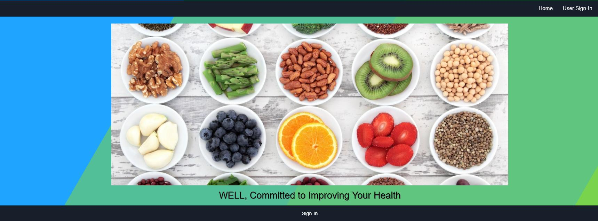
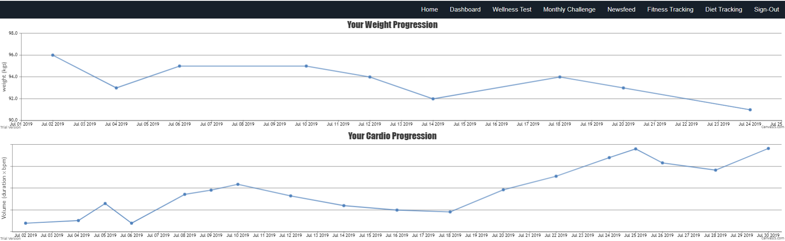
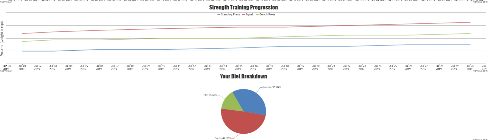
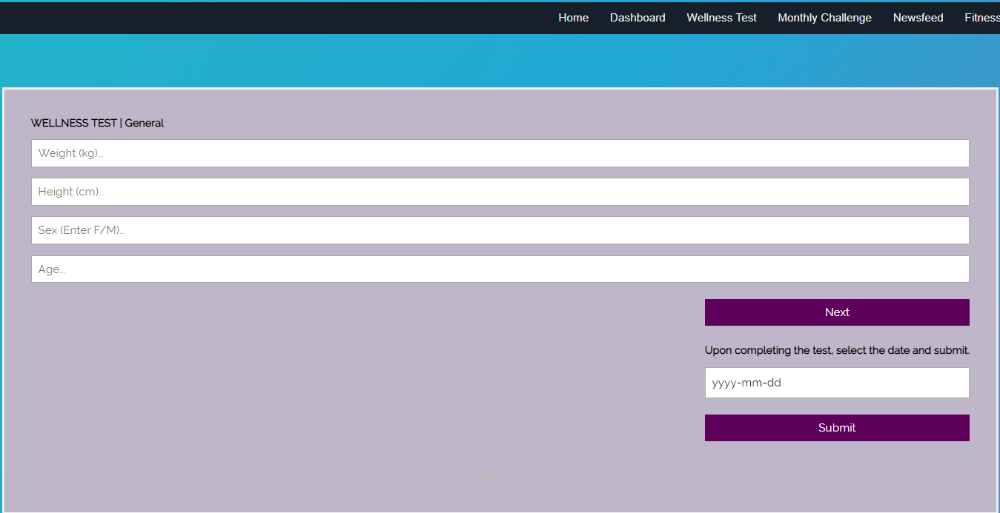
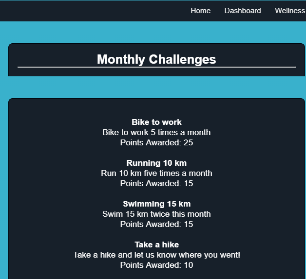
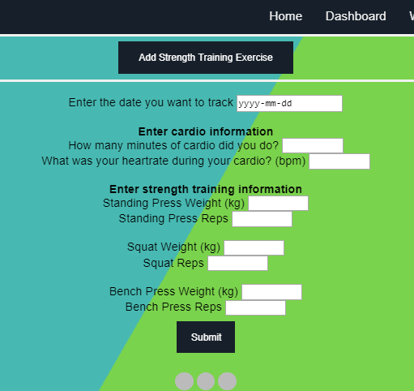
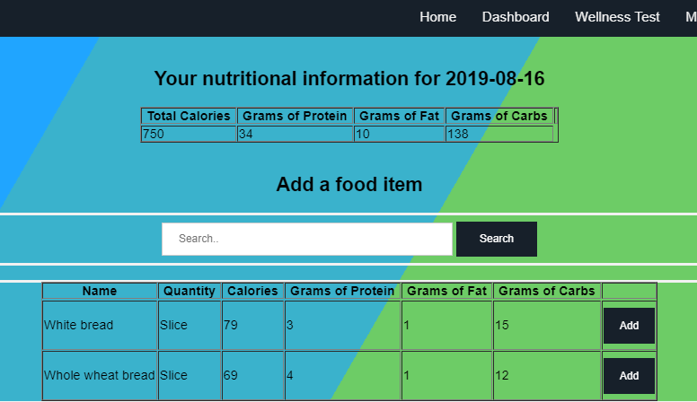
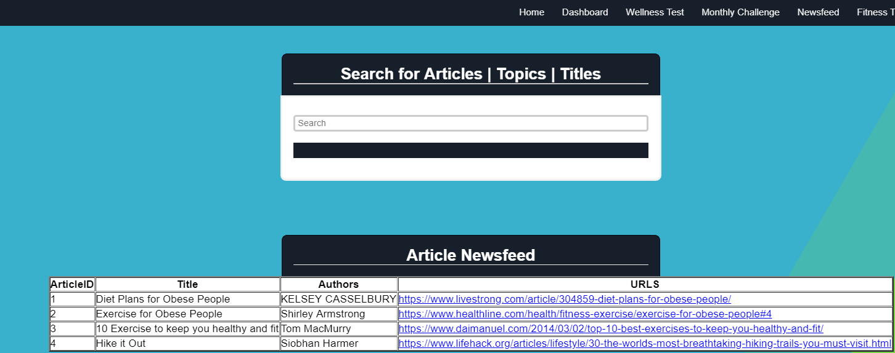

# Wellness

Health and fitness tracker web application.

## Authors

panktiHT, FredReinink.

## About

Created for Database Management Systems in Spring 2019, this application allows users to track detailed information about their
exercises and diet. Alongside this, there is a social media component which allows users to view a community newfeed as well 
as participate in sitewide monthly challenges and compete for rankings on a global leaderboard.  

As this was for a databases course, this application is heavily data-focussed with development emphasis on database management best practices 
and proper application-server communcation.

## Technologies

The front-end is written in HTML5, CSS, and Javascript for drawing charts and graphs.  
Database code is written in SQL and all back-end is done in PHP.

## Screenshots

;

;

;

;

;

;

;

;
